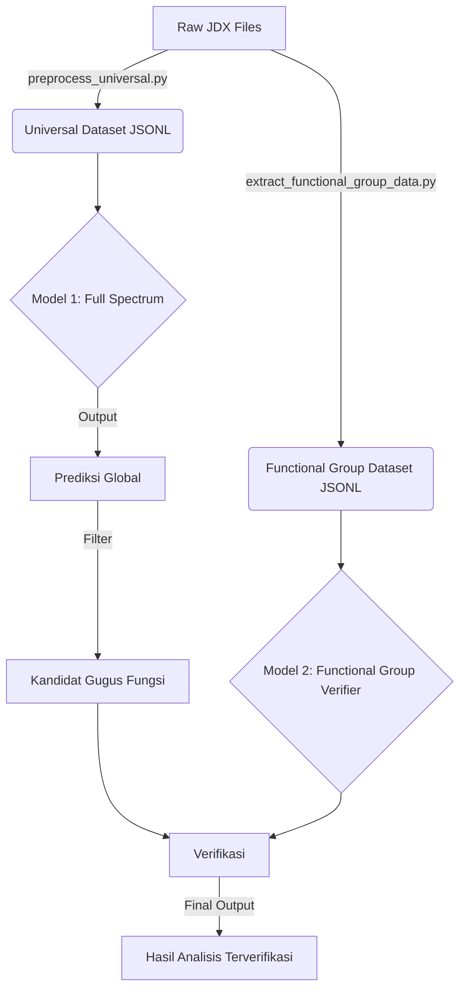

# Skema Arsitektur AI Analisis Spektrum

Dokumen ini menjelaskan rancangan teknis lengkap untuk dua model AI yang akan dibangun: **Model Full Spectrum** (Deteksi Global) dan **Model Gugus Fungsi** (Verifikasi Lokal).

## 1. Alur Data (Data Flow)



---

## 2. Detail Model 1: Full Spectrum (Global Detection)

Model ini melihat "hutan" (keseluruhan spektrum) untuk menebak apa saja yang ada di dalamnya.

- **Tujuan**: Multi-label Classification (Satu spektrum bisa memiliki banyak gugus fungsi).
- **Input**: Vektor 1D panjang 3911 (Absorbansi pada 4000 cm⁻¹ s.d. 90 cm⁻¹).
- **Output**: Probabilitas untuk setiap kelas gugus fungsi (misal: 12 kelas).

### Arsitektur (1D CNN)

| Layer      | Type              | Configuration                      | Output Shape         | Penjelasan                         |
| :--------- | :---------------- | :--------------------------------- | :------------------- | :--------------------------------- |
| **Input**  | InputLayer        | `(3911, 1)`                        | `(Batch, 3911, 1)`   | Data spektrum mentah               |
| **1**      | Conv1D            | Filters: 32, Kernel: 15, Stride: 2 | `(Batch, 1956, 32)`  | Deteksi fitur kasar (puncak lebar) |
| **2**      | BatchNorm + ReLU  | -                                  | -                    | Stabilisasi & Aktivasi             |
| **3**      | MaxPooling1D      | Pool: 2                            | `(Batch, 978, 32)`   | Reduksi dimensi                    |
| **4**      | Conv1D            | Filters: 64, Kernel: 7, Stride: 1  | `(Batch, 978, 64)`   | Deteksi fitur halus (puncak tajam) |
| **5**      | BatchNorm + ReLU  | -                                  | -                    | -                                  |
| **6**      | MaxPooling1D      | Pool: 2                            | `(Batch, 489, 64)`   | -                                  |
| **7**      | Conv1D            | Filters: 128, Kernel: 5, Stride: 1 | `(Batch, 489, 128)`  | Fitur kompleks                     |
| **8**      | GlobalAveragePool | -                                  | `(Batch, 128)`       | Rata-rata fitur per channel        |
| **9**      | Dense (FC)        | Units: 128, ReLU                   | `(Batch, 128)`       | Layer klasifikasi                  |
| **10**     | Dropout           | Rate: 0.5                          | -                    | Mencegah overfitting               |
| **Output** | Dense             | Units: N_Classes, **Sigmoid**      | `(Batch, N_Classes)` | Probabilitas (0.0 - 1.0) per gugus |

---

## 3. Detail Model 2: Functional Group Verifier (Local Check)

Model ini melihat "pohon" (potongan spesifik) untuk memastikan apakah bentuk puncaknya valid.

- **Tujuan**: Binary Classification (Valid / Invalid) untuk satu gugus fungsi spesifik.
- **Input 1 (Spectrum)**: Potongan spektrum (Slice) yang di-resize ke panjang tetap (misal 128 poin).
- **Input 2 (Group ID)**: Identitas gugus fungsi yang sedang dicek (misal: "Carbonyl").
- **Output**: Score Validitas (0.0 - 1.0).

### Arsitektur (Siamese-style / Embedding Network)

```mermaid
graph LR
    subgraph Input
    A[Spectral Slice (128, 1)]
    B[Group ID (Int)]
    end

    subgraph Feature Extraction
    A --> C[Conv1D (32, k=5)]
    C --> D[MaxPool (2)]
    D --> E[Conv1D (64, k=3)]
    E --> F[GlobalAvgPool]
    F --> G[Spec Vector (64)]
    end

    subgraph Embedding
    B --> H[Embedding Layer]
    H --> I[Group Vector (16)]
    end

    subgraph Fusion
    G --> J[Concatenate]
    I --> J
    J --> K[Dense (64) + ReLU]
    K --> L[Output (Sigmoid)]
    end
```

### Strategi Training (PENTING)

Karena kita hanya mengekstrak data positif, training loop harus pintar:

1.  **Ambil Sampel Positif**: Dari `functional_group_spectral_data.jsonl`.
    - _Contoh_: Ambil slice Carbonyl dari file A (yang memang punya Carbonyl).
    - Label: `1`
2.  **Generate Sampel Negatif (On-the-fly)**:
    - Ambil file B (yang **TIDAK** punya Carbonyl).
    - Potong di range yang sama (1700-1750 cm⁻¹).
    - Label: `0`
3.  **Ratio**: 50% Positif, 50% Negatif dalam setiap batch.

---

## 4. Cara Kerja Gabungan (Inference)

Saat user memasukkan file baru:

1.  **Langkah 1 (Global Scan)**:
    - Model 1 memproses seluruh spektrum.
    - Hasil: "Kemungkinan ada **Carbonyl (90%)** dan **Alkane (99%)**".
2.  **Langkah 2 (Local Verification)**:
    - Sistem memotong spektrum di area Carbonyl (1700-1750).
    - Model 2 mengecek potongan tersebut: "Bentuk puncak ini valid untuk Carbonyl (Score: 0.95)".
    - Sistem memotong spektrum di area Alkane (2850-3000).
    - Model 2 mengecek: "Bentuk ini valid untuk Alkane (Score: 0.98)".
3.  **Keputusan Akhir**:
    - Jika Model 1 Yakin DAN Model 2 Valid -> **Tampilkan**.
    - Jika Model 1 Yakin TAPI Model 2 Invalid (misal noise) -> **Discard / Low Confidence**.
